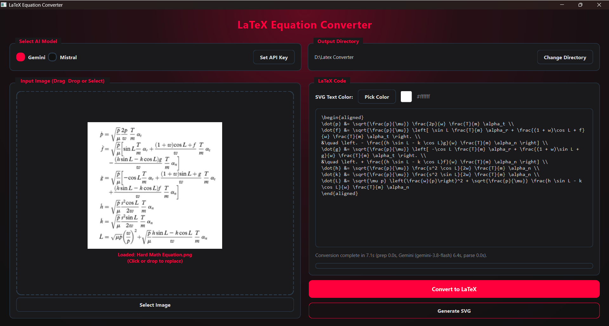

# LaTeX Equation Converter & Vector Generator


A high-performance desktop application built with **PySide6 (Qt for Python)**, **Google Gemini / Mistral AI (via OpenRouter)**, and a local **MathJax Node.js** renderer. It extracts complex math equations from images, converts them into standard AMS-LaTeX, and generates publication-grade SVG vector files—specifically optimized for seamless Microsoft PowerPoint vector shape conversion and editing.



---

## Key Features

- **AI-Powered Image-to-LaTeX Extraction**:
  - **Google Gemini**: Uses `gemini-3.8-flash` via the official `google-genai` SDK with low-latency thinking configuration (`ThinkingLevel.LOW`) and automatic function calling disabled. If that model is overloaded, the app automatically falls back through `gemini-3.7-flash`, `gemini-3.6-flash`, and `gemini-3.5-flash` (see *Resilient Networking* below).
  - **Mistral AI**: Uses `mistralai/mistral-small-3.1-24b-instruct:free` via OpenRouter (OpenAI-compatible client).
  - **Intelligent Preprocessing**: Automatically handles EXIF orientation, composites transparent PNGs over a clean white background, scales within a 2048px bounding box, and compresses to a high-quality JPEG under 2 MB to ensure rapid API transmission.
  - **Resilient Networking & Telemetry**: 60-second per-attempt timeout; up to 3 attempts per Gemini model with exponential backoff and jitter (~2s, ~4s) on transient errors (HTTP 408, 429, 500, 502, 503, 504, transport errors), then automatic fallback to the next model in the chain. Permanent errors (invalid API key, bad request) fail immediately instead of retrying. Live status bar updates report each attempt, which model answered, and preparation / API / parsing elapsed times.
  - **Strict Output Formatting**: System prompts enforce pure AMS-LaTeX snippets (using `aligned` for multi-line systems and `\text{...}` for prose) and strip preamble wrappers (`\documentclass`, `\begin{document}`) or markdown code fences.
  - **Clean Connection Teardown**: Automatically closes persistent HTTP client sessions when closing the application.

- **Fast, 100% Local & Offline MathJax Renderer**:
  - Subprocess execution (`render_mathjax.js`) utilizing local Node.js and MathJax v3.
  - Comprehensive TeX package support (`amsmath`, `amssymb`, `cancel`, `textmacros`, `mhchem`, and all standard MathJax TeX extensions).
  - Zero external HTTP dependencies for LaTeX-to-SVG rendering.

- **Optimized for Microsoft PowerPoint Vector Shapes**:
  - Renders with `fontCache: 'none'` to embed direct `<path>` and `<rect>` vector geometries rather than `<use>` glyph references.
  - Converts sizing units from `ex` to standard `px` dimensions (16px base scale).
  - Explicitly injects zero-stroke attributes (`stroke="none" stroke-width="0" stroke-opacity="0"`) on math glyphs and solid bars (fraction lines, radical vinculums) so converted PowerPoint shapes import with sharp, clean edges and no unwanted thick default borders.
  - Differentiates enclosure boxes (e.g., `\boxed{...}`, `\menclose{...}`), preserving visible colored stroke outlines without duplicate or conflicting fill styles.
  - Outputs standalone SVGs with standard XML declaration headers.

- **Cyberpunk Dark Theme UI**:
  - Custom radial gradient shader glow background anchored top-center.
  - Interactive **Drag & Drop** drop zone supporting `.png`, `.jpg`, and `.jpeg` images.
  - Live color picker with dynamic hex preview and real-time color badge (defaults to `#ff003c`).
  - Monospace LaTeX editor allowing full manual review and edits before SVG compilation.
  - Non-blocking asynchronous multithreading (`QThread`) keeping the UI responsive during AI extraction and SVG compilation.
  - Automatic output directory reveal and a non-intrusive 5-second auto-dismissing success dialog upon SVG generation.
  - Local API key persistence in `.env` (excluded from Git).

---

## Prerequisites

Ensure you have the following installed on your system:

1. **Python 3.10+** (with `pip`)
2. **Node.js 18+** (with `npm`) &mdash; *Required for local MathJax SVG rendering*

---

## Installation & Setup

1. **Clone the Repository**:

   ```bash
   git clone https://github.com/mina-fady1/Latex-Converter.git
   cd Latex-Converter
   ```

2. **Set Up a Python Virtual Environment**:

   ```bash
   python -m venv .venv

   # On Windows (PowerShell):
   .venv\Scripts\activate

   # On Windows (Command Prompt):
   .venv\Scripts\activate.bat

   # On macOS / Linux:
   source .venv/bin/activate
   ```

3. **Install Python Dependencies**:

   ```bash
   pip install -r requirements.txt
   ```

4. **Install Node.js MathJax Dependencies**:

   ```bash
   npm install
   ```

---

## Running the Application

Launch the application using either entry script:

```bash
python main_app.py
# or
python latex_converter.py
```

---

## How to Use

1. **Configure AI API Keys**:
   - Select your preferred model (**Gemini** or **Mistral**) in the top panel.
   - Click **Set API Key**.
     - For **Gemini**: Enter your API key from [Google AI Studio](https://aistudio.google.com/).
     - For **Mistral**: Enter your API key from [OpenRouter](https://openrouter.ai/).
   - Keys are automatically loaded from and saved to your local `.env` file (which is excluded from Git). Alternatively, you can copy `.env.example` to `.env` and set `GEMINI_API_KEY` and `MISTRAL_API_KEY` manually.
2. **Load an Equation Image**:
   - Drag and drop any `.png`, `.jpg`, or `.jpeg` file directly onto the drop zone, or click **Select Image** / drop zone to browse.
   - Sample test images are provided in the root directory (`Hard Math Equation.png`) and in `screenshots/` (`1.jpeg` through `6.jpeg`).
3. **Convert Image to LaTeX**:
   - Click **Convert to LaTeX**.
   - The AI worker extracts the equation and displays the editable AMS-LaTeX code in the central editor. The status bar will show step-by-step progress and timing metrics.
4. **Choose SVG Text Color & Generate**:
   - Click **Pick Color** to choose any custom accent color for the SVG math symbols (defaults to `#ff003c`).
   - Click **Generate SVG**.
   - The app compiles the SVG locally using MathJax, saves it to `{output_directory}/{image_name}_latex/equation.svg`, opens the output folder in your file explorer, and displays a confirmation dialog that automatically dismisses after 5 seconds.

---

## Microsoft PowerPoint Vector Shape Guide

To convert your generated SVG into editable, high-resolution Microsoft PowerPoint shapes:

1. Drag and drop the generated `equation.svg` file directly onto your PowerPoint slide (or use **Insert -> Pictures -> This Device**).
2. Right-click the SVG on the slide and choose **Convert to Shape** (or select it and press `Ctrl + Shift + G` to ungroup).
3. PowerPoint will turn each math symbol and stroke into an individual native vector shape that you can resize without quality loss, recolor, animate, or re-arrange.
4. If an outline appears on older Office versions, select all shapes and set **Shape Format -> Shape Outline -> No Outline**.

---

## Project Structure

```
Latex-Converter/
├── latex_converter.py     # Main PySide6 application window, widgets, and GUI logic
├── main_app.py            # Application entry point
├── ai_models.py           # Gemini (3.8 Flash + fallback chain) & Mistral (OpenRouter) integrations
├── async_workers.py       # QThread background workers for non-blocking AI calls & SVG rendering
├── ui_styles.py           # Cyberpunk dark theme stylesheet (QSS) & color palette
├── render_mathjax.js      # Local Node.js MathJax TeX-to-SVG rendering engine
├── package.json           # Node.js manifest & MathJax dependencies
├── package-lock.json      # Locked Node.js dependency tree
├── requirements.txt       # Python dependencies (PySide6, google-genai, openai, Pillow, requests, python-dotenv)
├── .env.example           # Environment variables template for API keys
├── .env                   # Local API key storage (auto-generated, gitignored)
├── Hard Math Equation.png # Sample root test equation image
├── Project.jpg            # Application screenshot for README
├── screenshots/           # Sample test equation images (1.jpeg - 6.jpeg)
├── .gitignore             # Git exclusion rules
└── README.md              # Project documentation
```

---

## Troubleshooting

- **"Node.js is not installed or not found in system PATH"**:
  - Download and install Node.js (LTS version recommended) from [nodejs.org](https://nodejs.org/).
  - Ensure `node` and `npm` are available in your system's `PATH`. Run `node -v` in your terminal to verify.
- **MathJax module missing**:
  - Run `npm install` inside the project root directory so `node_modules/mathjax` is installed.
- **"All Gemini models are busy" / HTTP 503 "high demand"**:
  - This is a temporary capacity problem on Google's servers, not a bug in the app or a problem with your key. The app already retried with backoff and tried each fallback model before showing this message.
  - Wait a minute or two and click **Convert to LaTeX** again, or switch to **Mistral** in the model selector.
  - When a fallback model answers, the status bar shows its name, e.g. `Gemini (gemini-3.7-flash)`. Older models can read very dense equations slightly less accurately, so double-check the LaTeX in the editor.
  - To change the fallback order or retry counts, edit `GEMINI_MODEL_CHAIN`, `GEMINI_ATTEMPTS_PER_MODEL`, and the `GEMINI_BACKOFF_*` constants at the top of `ai_models.py`.
- **API Key Errors**:
  - Verify that your Gemini key is active in Google AI Studio or your OpenRouter key has access to the Mistral model.
- **LaTeX Syntax Errors during SVG Generation**:
  - If MathJax reports invalid LaTeX syntax, inspect the code in the monospace editor to ensure braces and environments (such as `\begin{aligned}...\end{aligned}`) are balanced.

---

## License

Distributed under the MIT License.
